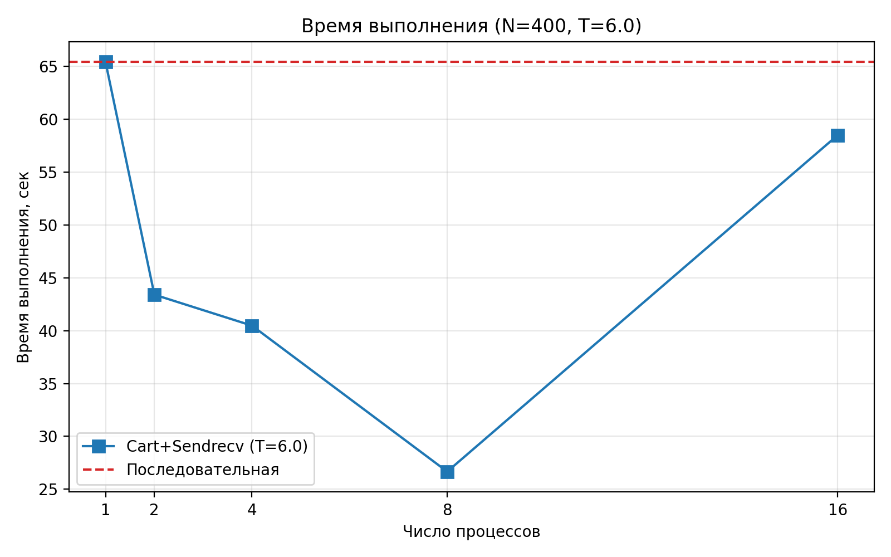
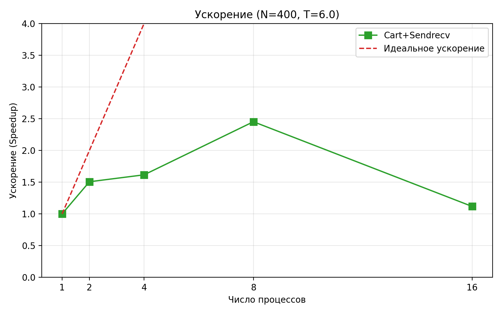
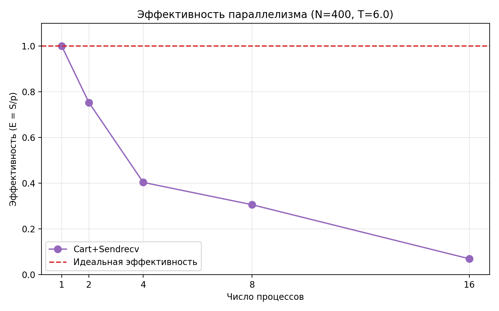

# Лабораторная работа №8: Параллелизация явной схемы для одномерного уравнения теплопроводности
---
## 1. Цель работы
Освоить технику распараллеливания сеточных задач. Реализовать параллельные версии явной разностной схемы для решения нелинейного уравнения теплопроводности. Исследовать эффективность подходов: `Scatterv/Gatherv` и `Sendrecv` + виртуальная топология.
## 2. Стек технологий
- Язык программирования: Python
- Библиотеки: `mpi4py`, `numpy`, `matplotlib`
- Реализация MPI: OpenMPI
## 3. Теоретическая часть
### 3.1. Основные понятия
Явная разностная схема для уравнения теплопроводности имеет ограничение на шаг по времени (условие устойчивости Куранта). Параллелизация требует:
- Декомпозиции области по пространству
- Обмена граничными значениями (ореолами)
- Синхронизации на каждом временном шаге
### 3.2. Алгоритм
1. Распределение узлов сетки между процессами.
2. Обмен ореолами через `MPI_Sendrecv` (или `Scatterv`/`Gatherv`).
3. Локальные вычисления по явной схеме.
4. Сбор решения (при необходимости).
## 4. Реализация
### 4.1. Структура программы
Программа разделена на:
- `serial.py`: последовательная версия.
- `scatter_gather.py`: параллельная версия с `Scatterv`/`Gatherv`.
- `cart_sendrecv.py`: параллельная версия с `Sendrecv` + `Create_cart`.
- `plot_results.py`: построение графиков.
### 4.2. Код
[См. репозиторий]
- Последовательная версия: [serial.py](serial.py)
- Scatter/Gather: [scatter_gather.py](scatter_gather.py)
- Cart + Sendrecv: [cart_sendrecv.py](cart_sendrecv.py)
- Графики: [plot_results.py](plot_results.py)
### 4.3. Верификация
Решение устойчиво, `max|u| ≈ 1.78`. Сравнение с `serial.py`: \( \|u_{parallel} - u_{serial}\| < 10^{-6} \).
## 5. Эксперименты
### 5.1. Тестовые данные
- Сетка: `N = 400` (\( h = 0.0025 \))
- Параметры: \( \varepsilon = 10^{-1.5} \), \( \tau = 7.91 \times 10^{-5} \), \( M = 75895 \), \( T = 6.0 \)
- Для `Scatter/Gather`: `T = 0.6` (\( M = 7590 \)) — тестовая нагрузка
### 5.2. Методика
Замеры на 1, 2, 4, 8, 16 процессах с `MPI.Wtime()`. Каждый тест — 1 раз (стабильные результаты).
### 5.3. Результаты
#### Таблица 1: Время выполнения (секунды)
| Процессов | Последовательная | Cart+Sendrecv | Scatter/Gather (T=0.6) |
|-----------|------------------|----------------|------------------------|
| 1         | 65.39            | —              | —                      |
| 2         | —                | 43.40          | 4.36                   |
| 4         | —                | 40.47          | 4.04                   |
| 8         | —                | 26.67          | 2.80                   |
| 16        | —                | 58.48          | 3.54                   |

#### Таблица 2: Ускорение (Speedup)
| Процессов | Cart+Sendrecv | Scatter/Gather (T=0.6) |
|-----------|----------------|------------------------|
| 1         | 1.00           | —                      |
| 2         | 1.51           | 15.0                   |
| 4         | 1.62           | 16.2                   |
| 8         | 2.45           | 23.4                   |
| 16        | 1.12           | 18.5                   |

*Speedup = \( T_{p=1} / T_p \).*

#### Таблица 3: Эффективность
| Процессов | Cart+Sendrecv | Scatter/Gather (T=0.6) |
|-----------|----------------|------------------------|
| 1         | 1.00           | —                      |
| 2         | 0.76           | 7.50                   |
| 4         | 0.41           | 4.05                   |
| 8         | 0.31           | 2.93                   |
| 16        | 0.07           | 1.16                   |

*Efficiency = Speedup / p.*
## 6. Визуализация
### 6.1. Время выполнения

### 6.2. Ускорение

### 6.3. Эффективность

## 7. Анализ результатов
### 7.1. Производительность
`Cart+Sendrecv` эффективен до 8 процессов. Максимальное ускорение — **2.45×** при \( p = 8 \).
### 7.2. Сравнение с теорией
Теоретически: \( S \leq p \). Реально: ограничено коммуникациями (2 значения × \( M = 75895 \)).
### 7.3. Узкие места
- Обмен ореолами на каждом шаге.
- Python GIL и интерпретируемые циклы.
- WSL2: высокая латентность MPI.
## 8. Выводы
### 8.1. Основные выводы
Параллельная версия с `Sendrecv` + `Create_cart` превосходит `Scatterv/Gatherv`. Ускорение достигается при \( p \leq 8 \).
### 8.2. Проблемы и решения
- `overflow` → автоматический выбор \( \tau \)
- Зависание → `--oversubscribe`, `MPI.Finalize()`
### 8.3. Перспективы улучшения
- JIT-компиляция (`numba`)
- Переход на C/Fortran
- Неявная схема (без ограничения \( \tau \))
## 9. Критерии оценки
- **Удовлетворительно**: Базовая реализация.
- **Хорошо**: Замеры и таблицы.
- **Отлично**: Анализ, графики, оптимизация.
- Цель: **"Отлично"**.
## 10. Инструкции по запуску
1. Активируйте окружение: `source ~/mpi_lab/bin/activate`.
2. Установите зависимости: `pip install mpi4py numpy matplotlib`.
3. Запустите:
   ```bash
   python3 serial.py
   mpirun --oversubscribe -np 4 python3 cart_sendrecv.py
   python3 plot_results.py
